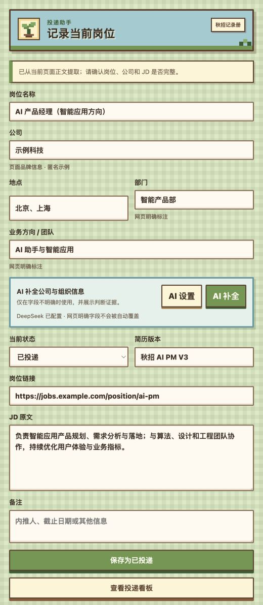

# 投递助手（Chrome 扩展）
以前投实习的时候，我还会老老实实打开 Excel，一条一条复制公司、岗位、链接和 JD。
但秋招要投的岗位一多，光整理信息就很费时间。于是我做了一个 Chrome 插件：打开岗位详情页，点一下插件，就能自动抓取当前岗位的信息。

它可以记录：
岗位名称、公司、地点和岗位链接
完整 JD 原文
投递日期和使用的简历版本
已投递、笔试、面试、Offer 等进度

确认后，岗位会直接进入投递看板。之后可以搜索公司、岗位和 JD 关键词，修改投递日期和进度，随时回看原岗位链接，还能把全部记录导出成 Excel。
同一个岗位链接重复保存也不会堆出一排重复记录，而是保留最新一次更新。
部分招聘网站对公司、部门的标注比较混乱，所以插件还支持配置自己的 DeepSeek API Key，让 AI 根据页面内容补全不确定的信息；不想使用 AI 的话，也可以直接在保存前手动修改。

界面采用星露谷田园像素风设计。

## 界面预览

以下使用匿名示例数据，不包含真实投递记录或 API Key。

## 安装

1. 在 Chrome 地址栏打开 `chrome://extensions/`。
2. 打开右上角“开发者模式”。
3. 点击“加载已解压的扩展程序”。
4. 选择下载或克隆后的项目文件夹。
5. 把“投递助手”固定到浏览器工具栏。

## 使用

1. 打开岗位详情网页，确认页面上已经显示完整 JD。
2. 点击工具栏中的“投递助手”。
3. 核对自动提取结果，选择简历版本，点击“保存为已投递”。
4. 保存后点击下方“查看投递看板”，即可搜索 JD、查看原链接，或修改投递日期与进度。

## 可选 AI 补全

当公司、部门或业务方向不明确时，可以点击“AI 补全”。首次使用需要在弹窗的“AI 服务设置”中选择服务并填写对应 API Key。默认使用 `deepseek-v4-flash`，也可以切换到 OpenAI，或者完全关闭 AI。

- DeepSeek 使用官方 `chat/completions` 与 [JSON Output](https://api-docs.deepseek.com/guides/json_mode/)；字段提取会关闭思考模式，返回结果仍会经过插件本地字段校验。
- OpenAI 使用 [Responses API Structured Outputs](https://developers.openai.com/api/docs/guides/structured-outputs)。
- 两种服务都只发送当前岗位页文字和结构化信息，默认不发送网页截图。

- 网页已经明确的高可信字段不会被 AI 自动覆盖。
- 部门没有明确证据时保持为空。
- 业务方向允许标记为“语义推断”，保存前仍可人工确认。
- DeepSeek 与 OpenAI 的 API Key 分开保存在当前 Chrome 配置的扩展本地存储中，不会进入投递记录或 Excel。

看板右上角可以导出 Excel `.xlsx` 表格，包含公司、岗位、部门、业务方向、字段识别依据、地点、投递时间、简历版本、进度、岗位链接、JD 原文和备注。投递数据保存在这个 Chrome 配置的扩展本地数据库中；卸载扩展前请先导出表格。

## 当前边界

- 能读取普通岗位详情页和提供 Schema.org `JobPosting` 数据的页面。
- 浏览器内部页面、PDF、Chrome 应用商店页面不能读取。
- 登录后通过跨域 iframe、图片或画布展示的 JD 可能只能保留链接和页面标题，需要人工补充。
- 不会自动读取邮箱，也不会自动判断你是否真的点击了招聘网站的“提交申请”。只有你点击扩展并确认保存后，记录才成立。
- AI 补全依赖所选服务商的 API 账户与可用额度；没有配置 API Key 时，其余本地采集、保存、看板和 Excel 功能仍可正常使用。

## License

本项目采用 [MIT License](LICENSE)。你可以使用、修改和分发本项目，但需要保留原始版权与许可声明；软件按现状提供，不附带担保。
